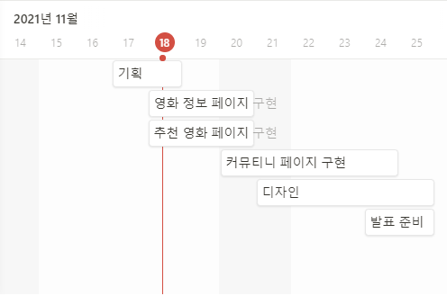

## 최종_PJT



https://www.notion.so/6f2e2740f0024677a705942db5888a55?v=2cd78282f7b249d182d3645b8813ed91

### * 계획

| 날짜  | 링크                                                         |
| ----- | ------------------------------------------------------------ |
| 11/17 | https://valiant-eustoma-bc0.notion.site/4947f5644c124a158da20397e5d9ae3a?v=7c48e54c859b46438bf967b239ccb2e4 |
| 11/18 | https://valiant-eustoma-bc0.notion.site/de071b872e864f72820377cdd6b2a5ec?v=732ab8722355466d8b4c6d976f646982 |
| 11/19 | https://valiant-eustoma-bc0.notion.site/4e78ebbbca4f45e7b717d6aa36664e16?v=3b1e0339dabe4ea1b75d944b5048f8d0 |
| 11/22 | https://valiant-eustoma-bc0.notion.site/dc7975761bf54d16b6ab048966098581?v=c1ba509a5ea44823be97e78345d7b185 |
|       |                                                              |
|       |                                                              |

>  노션에 올려두었습니다!


### 1) 팀원 정보 및 업무 분담 내역

* 팀장 : 김지원
* 팀원 : 김소희

|       | 김지원                                    | 김소희                                    | 공통                              |
| ----- | ----------------------------------------- | ----------------------------------------- | --------------------------------- |
| 11/17 | ERD만들기, 검색기능 및 알고리즘 구현 고민 | TMDB API 사용법 및 json파일 생성          | Django 기본템플릿 만들고 db설정   |
| 11/18 | 영화 검색 알고리즘구현,tmdb api 파싱      | 영화상세페이지 댓글,좋아요 기능구현       | 오류수정및 ERD수정                |
| 11/19 | 찜한목록 기반 추천영화만들기              | 영화 상세페이지 평점 기능구현 및 오류수정 | 각자 맡은부분 설명 및 디자인 기획 |
| 11/22 |                                           |                                           |                                   |
|       |                                           |                                           |                                   |
|       |                                           |                                           |                                   |


### 2)목표 서비스 구현 및 실제 구현 정도

```
1.영화 정보
-첫페이지 tmdb평점과 우리사이트의 평점 2개 모두출력하기
-영화자료는 tmdb popular에서 가져오기
-영화 디테일안에 좋아요, 댓글, 평점기능
->추후 시간남을시 장르별로,평점별로 배열하는방법들 추가

2.추천영화시스템
-랜덤방식 바꾸기
-검색을 장르별로 태그띄워서 검색하기 -> 추천알고리즘으로 이어짐
관련 장르 영화많을수록, ㄱㄴㄷ순으로 띄워주기 그리고
ex) [멜로,액션,다큐] 이런식으로 연관된 검색어가 많을수록 +=1 식으로 만들어서
우선순위 만들어주기

3.커뮤니티
-글작성페이지
-커뮤니티페이지

4.나중에 추가해도 되는 기능
-소셜로그인기능
-데이터 가져오는방식(다른 API고려)
-디자인 (부트스트랩, 부트스트랩 템플릿 고려예정)
-그외 추가 토론
```


### 3)데이터베이스 모델링 (ERD)

`https://app.diagrams.net/#G19VEuX7y4Hxe2dh0q0Ryx-1p-6nkAnr1I`


### 4)필수 기능에 대한 설명

A.관리자 뷰

->완성

B.영화 정보

->TMDB 에서 200개 영화 json파일로 가져오기

C.추천 알고리즘

->태그로 장르 검색후 -> 관련 영화 우선순위로 띄워주기

D.커뮤니티

->기본 게시판

E.기타

->최소 5개이상의 URL및 페이지


### 5)배포 서버 URL

-진행중-

수업중에 진행한 AMAZON 사용 예정...?


### 6)기타(느낀점)

* 11/17

처음 기획하는곳이 의외로 많은 시간을 잡아먹는다는 생각을 했습니다.

기본 ERD를 작성하는것도그렇고 실제 구현하는시간보다 아이디어 구상이 더많은

시간이 필요하다는 생각이 듭니다.

그리고 구현에 앞서 사용할 아키텍처를 정하는것도 중요하고 실제 개발보다 중요한것이

많다는 생각이 첫날부터 들었습니다.

무엇보다 협업툴을 사용하는것의 중요함과 편리성을 알게되었습니다.

노션과 디스코드를 적절하게 활용해서 개발을 진행하고 있습니다.

실제 완성은 오래 걸릴것 같지는 않지만 최대한 높은 퀄리티를 위해 더 고군분투할 예정입니다.

최고의...팀원과 말입니다.

- 11/18

  오늘은 공통협업도 있었지만 각자 분업을 맡았습니다.

  해당 과정에서 서로 어려운부분을 도와주고 도움받으며 그 전에 기획단계에서 교수님에게

  조언까지받으며 여러문제를 쉽게 해결할 수 잇었습니다.
  
- 11/19

  오늘 역시도 절반의 공통협업과 분업을 맡아 했습니다.

  작업의 속도역시 빨랐고, 기능을 합쳤을 때의 쾌감을 느낄 수 있었습니다.

  또한 각자 맡은부분을 설명해주어 추가적인 학습역시 잊지 않았습니다.


### 7)협업링크

https://valiant-eustoma-bc0.notion.site/4947f5644c124a158da20397e5d9ae3a?v=7c48e54c859b46438bf967b239ccb2e4


### 8)어려웠던점

* 11/17

json 파일을 기존에 쓴거말고 새로만들었는데 소히님이 매우매우매우 고군분투하여 완성시켰습니다.

휴.... 그다음엔 뭐.. imgsrc부분 어떻게 할지 고민이었는데 이역시도....

둘이 머리를 맞대어서 해결했읍니다....

내일 이어서 해보도록 하겠습니다

- 11/18

  검색 알고리즘 구현당시, 기본적인 javascript문법및 파이썬사용법을 다시 알아봐야 했습니다.

  또한 과거 첫수업때 사용했떤 requests를 불러와 사용하는것을 찾아보는데 조금 어려움을 겪었습니다.

  영화 상세페이지에 댓글과 좋아요기능을 새로 구성하는데 해당과정에서 모델 오류가 발생해 약간의 어려움이 있었지만

  소희님의 엄청난 오류해결능력으로 성공했습니다.
  
- 11/19

  댓글 평점기능구현시 별모양으로 뜨지않아 고민을 했지만 html파일 내부에서 if문을 사용하여 해결했습니다.

  찜한영화 기반으로 추천시 0개인경우및 여러변수에 대응하여 오류를 수정해야 했습니다.

---


