# 최종_PJT - 사용자 기반 영화 추천 사이트

#### 사용한기술들

- javascript, Django 그리고 필요할시 axios, bootstrap

- 노션 및 디스코드로 협업

  

## 1) 팀원 정보 및 업무 분담 내역

* 팀장 : 김지원
* 팀원 : 김소희

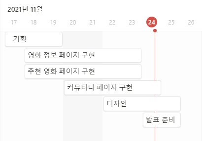

>  https://capable-ulna-be7.notion.site/SSAFY-final_project-4de6c6d8e44a4562aafb2c525d080011

|       | 김지원                                                       | 김소희                                                       | 공통                                     |
| ----- | ------------------------------------------------------------ | ------------------------------------------------------------ | ---------------------------------------- |
| 11/17 | ERD만들기, 검색기능 및 알고리즘 구현 고민                    | TMDB API 사용법 및 json파일 생성                             | Django 기본템플릿 만들고 db설정          |
| 11/18 | 영화 검색 알고리즘구현,tmdb api 파싱                         | 영화상세페이지 댓글, 좋아요 기능구현                         | 오류수정및 ERD수정                       |
| 11/19 | 찜한목록 기반 추천영화만들기                                 | 영화 상세페이지 평점 기능구현 및 오류수정                    | 각자 맡은부분 설명 및 디자인 기획        |
| 11/22 | 부트스트랩기반 디자인하기, 알고리즘수정,모달추가             | 프로필페이지 구현하기, 디자인하기                            | 파비콘 만들기, 로고만들기                |
| 11/23 | 게시판(페이지네이션,글쓰기), 영화목록 모달, 랜덤페이지, 장르추천 모달 및 수정 | 프로필페이지, 디테일페이지 디자인 및 수정, Navbar 디자인 수정 | 로그인,가입수정 및 각종디자인및 오류수정 |
| 11/24 | 라이센스정리,소스코드정리,aws배포                            | 로그인페이지 및 다른 페이지들 꾸미기, ppt고민                    | 로고만들기, 발표준비하기                 |
| 11/25 |                                                              |                                                              |                                          |
| 11/26 | 발표...하기! ㅠㅡㅠ                                          | 화이팅!!!                                                    | 힘내세연                                 |


## 2) 목표 서비스 구현 및 실제 구현 정도

```
1.영화 정보
-첫페이지 tmdb평점과 우리사이트의 평점 2개 모두출력하기
-영화자료는 tmdb popular에서 가져오기
-영화 디테일안에 좋아요, 댓글, 평점기능
->추후 시간남을시 장르별로,평점별로 배열하는방법들 추가

2.추천영화시스템
-랜덤방식 바꾸기
-검색을 장르별로 태그띄워서 검색하기 -> 추천알고리즘으로 이어짐
관련 장르 영화많을수록, ㄱㄴㄷ순으로 띄워주기 그리고
ex) [멜로,액션,다큐] 이런식으로 연관된 검색어가 많을수록 +=1 식으로 만들어서
우선순위 만들어주기

3.커뮤니티
-글작성페이지
-커뮤니티페이지

4.나중에 추가해도 되는 기능
-소셜로그인기능
-데이터 가져오는방식(다른 API고려)
-디자인 (부트스트랩, 부트스트랩 템플릿 고려예정)
-그외 추가 토론
```


## 3) 데이터베이스 모델링 (ERD)

`https://app.diagrams.net/#G19VEuX7y4Hxe2dh0q0Ryx-1p-6nkAnr1I`


## 4) 배포 서버 URL

-진행중-

수업중에 진행한 AMAZON 사용 예정...?


## 5) 기타(느낀점)

 처음 기획하는 곳이 의외로 많은 시간을 잡아먹는다는 생각을 했습니다. 기본 ERD를 작성하는것도 그렇고 실제 구현하는 시간보다 아이디어 구상이 더많은 시간이 필요하다는 생각이 듭니다. 그리고 구현에 앞서 사용할 아키텍처를 정하는것도 중요하고 실제 개발보다 중요한 것이 많다는 생각이 첫날부터 들었습니다. 무엇보다 협업툴을 사용하는것의 중요함과 편리성을 알게되었습니다. 노션과 디스코드를 적절하게 활용해서 개발을 진행하고 있습니다. 실제 완성은 오래 걸릴것 같지는 않지만 최대한 높은 퀄리티를 위해 더 고군분투할 예정입니다. 최고의...팀원과 말입니다.

 각자 역할을 맡아 공통협업과 분업을 맡아 했습니다.  해당 과정에서 서로 어려운부분을 도와주고 도움받으며 그 전에 기획단계에서 교수님에게 조언까지받으며 여러문제를 쉽게 해결할 수 잇었습니다. 작업의 속도역시 빨랐고, 기능을 합쳤을 때의 쾌감을 느낄 수 있었습니다. 또한 각자 맡은부분을 설명해주어 추가적인 학습역시 잊지 않았습니다.


## 6) 어려웠던점

* json 파일을 기존에 쓴거말고 새로만들었는데 소희님이 매우매우매우 고군분투하여 완성시켰습니다. 휴.... 그다음엔 뭐.. imgsrc부분 어떻게 할지 고민이었는데 이역시도.... 둘이 머리를 맞대어서 해결했읍니다.... 이어서 해보도록 하겠습니다

* 검색 알고리즘 구현당시, 기본적인 javascript문법및 파이썬사용법을 다시 알아봐야 했습니다. 또한 과거 첫수업때 사용했떤 requests를 불러와 사용하는것을 찾아보는데 조금 어려움을 겪었습니다. 영화 상세페이지에 댓글과 좋아요기능을 새로 구성하는데 해당과정에서 모델 오류가 발생해 약간의 어려움이 있었지만 소희님의 엄청난 오류해결능력으로 성공했습니다.

* 댓글 평점기능구현시 별모양으로 뜨지않아 고민을 했지만 html파일 내부에서 if문을 사용하여 해결했습니다. 찜한영화 기반으로 추천시 0개인경우및 여러변수에 대응하여 오류를 수정해야 했습니다.

* 디자인 할때 버튼이 원하는 곳으로 이동하지 않아 열심히 고민하여 결국 grid system으로 해결하였습니다. 디자인이.. 하고나면 뿌듯하지만 그 과정은 매우 까다로워서 힘들었습니다.


## 7) 구현과정

### 1. 로그인, 회원가입 페이지

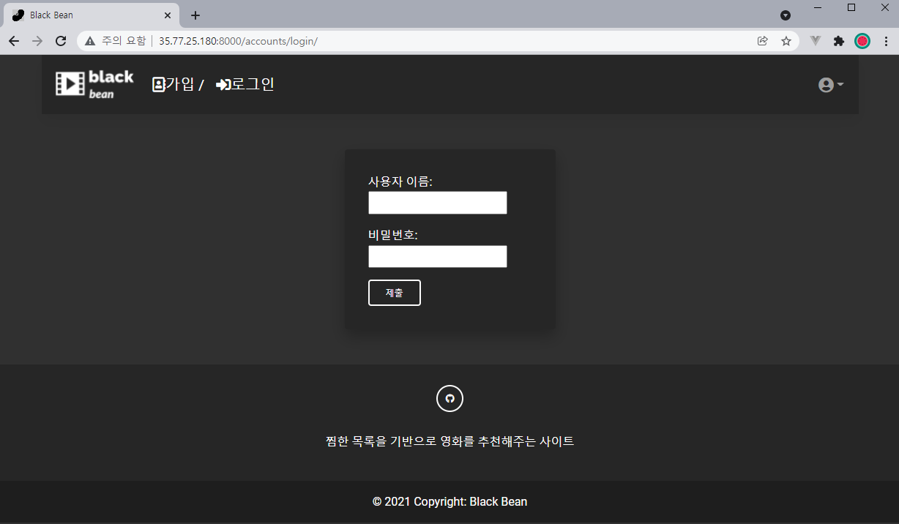

* 첫화면을 로그인 화면으로 만들었습니다. 이 사이트는 로그인 해야만 이용 할 수 있습니다!

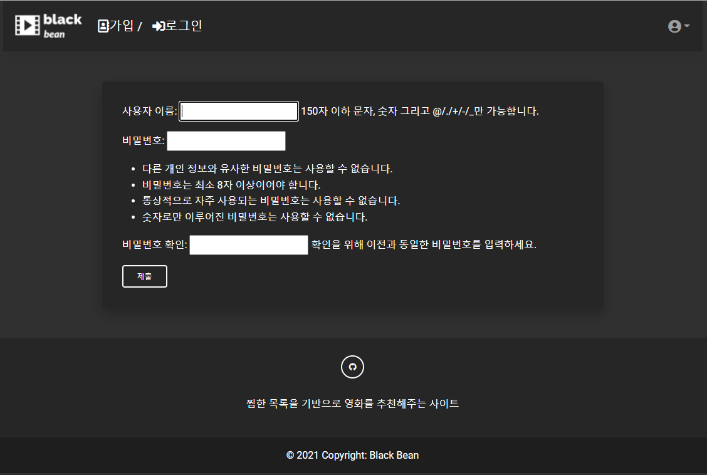

* 회원가입 페이지 입니다.


### 2. 영화 정보 상세 페이지(영화목록)

* 영화 정보
  
  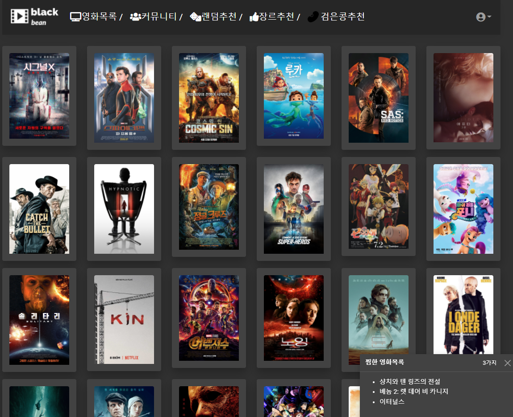

  * movies.json 파일을 loaddata를 이용해서 영화 정보 100개를 가져왔습니다. 이는 tmdb에서 popular 기준 100개의 영화 정보를 가져온 것입니다. 
  * Movie 모델을만들고, json파일과 똑같이 field를 만든 후 loaddata를 했습니다. 
  * 첫페이지영화 정보는 항상 랜덤으로 출력되게 배치 했습니다. views.py에서 order_by('?')로 구현
  * 나름의 반응형을 지원합니다.
  
  ---
  
  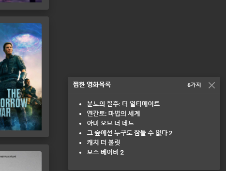
  
  - 로그인하고 처음 화면을 갈때마다 현재 찜한영화목록을 작게 팝업으로 뜨게 만들어 줬습니다.
  - 나름... 사용자 편의성을 고려했다고 볼 수 있습니다.
  
  ---
  
  
  
  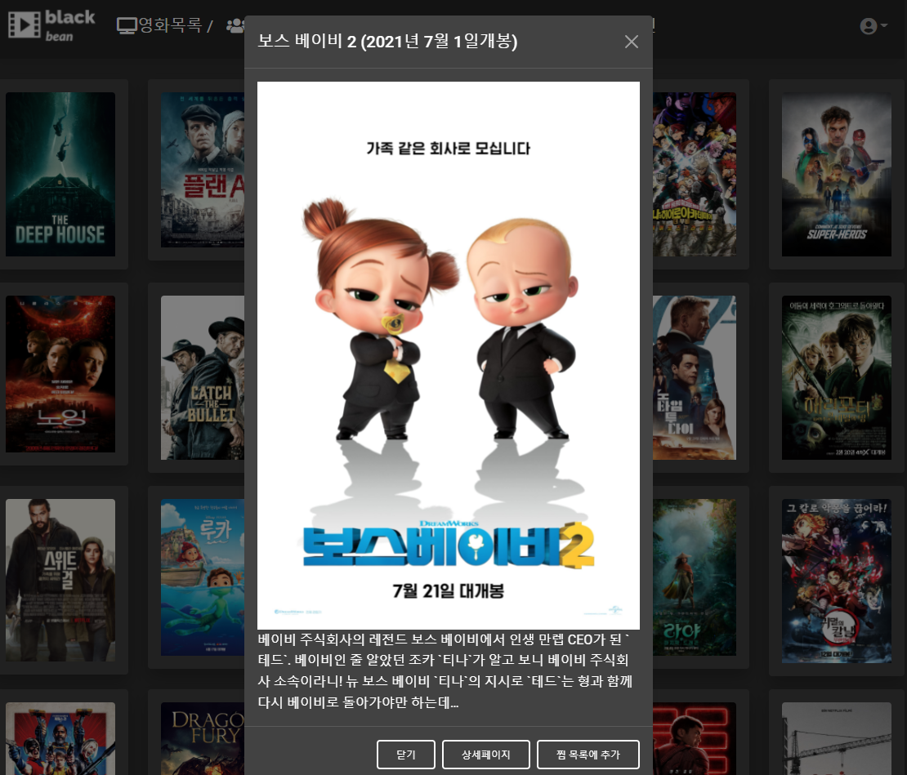
  
  - 처음 페이지부터 많은것을 출력하기보단 직관적으로 그림을 누르면 모달이 나오게 설정 하였습니다.
  
  - 해당 모달창에서는 상세페이지와 찜목록에 추가를 지원합니다.
  
  - 상세페이지는 영화의 상세페이지 및, 영화 개별 커뮤니티로 들어가 평점과 댓글 기능을 구현했고
  
  - 찜목록에 추가, 삭제는 axios를 이용해 구현했습니다.
  
    * 영화마다 `찜 목록에 추가` 버튼이 있는데 누르면 찜목록에 영화가 추가되고, 자신의 프로필에서 찜한 영화들을 모아 볼 수 있습니다.
  
    * Movie 모델의 field에 like_users를 추가해 주어, 영화를 찜할때 마다 `movies_movie_like_users` 테이블에 정보가 저장됩니다.
  
    * ```python
      like_users = models.ManyToManyField(settings.AUTH_USER_MODEL, related_name='like_movies')
      ```
  
    * 찜하기는 axios를 사용하여 찜할때 마다 전체 페이지가 새로고침되지 않도록 하였습니다.
  
  - 해당 찜목록은 프로필 페이지에서 확인 할 수 있습니다!
  
    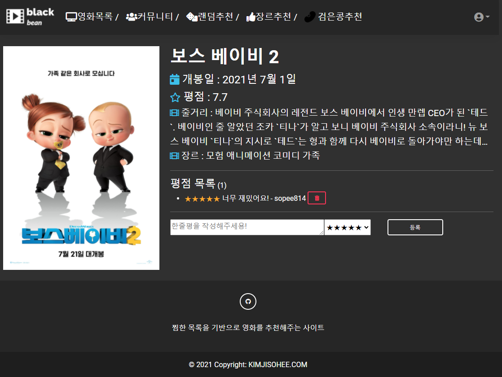
  
  - 평점 남기기
  
    * 평점으로 글과 별점을 남길 수 있습니다. 
  
    * 자신이 남긴 평점만 삭제할 수 있습니다.
  
    * MovieComment 모델을 만들고 content와 rank field를 만들어, rank는 별 1~5개중에 고를 수 있게 했습니다. form을 사용해서 작성 양식을 만들었습니다. 
  
    * ```python
      rank_choices = ((5, '★★★★★'),(4, '★★★★'),(3, '★★★'),(2, '★★'),(1, '★'))
      rank = models.IntegerField(choices=rank_choices)
      ```
  
    * 구현과정중에 rank를 CharField로 만들고 choices를 숫자로 만들어 평점등록이 안돼는 오류가 났었습니다. 하지만 바로 IntegerField로 바꾸어 해결하였습니다.
  
    * ```django
      ★
      ★★
      ★★★
      ★★★★
      ★★★★★
      
      ```
  
    * 평점을 출력할 때 점수가 아닌 별로 표현하고 싶어, 조건문을 사용하여 숫자로 된 별점을 별로 표현하였습니다.
  
  


---

### 3. 커뮤니티

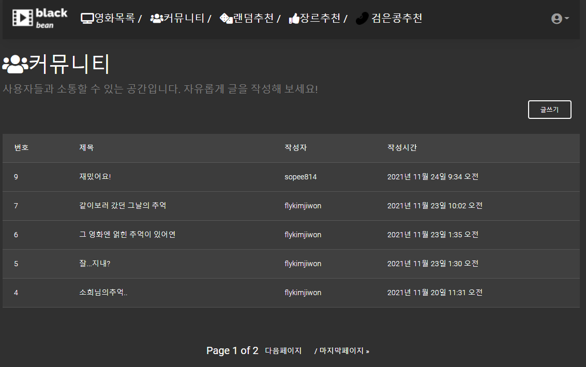

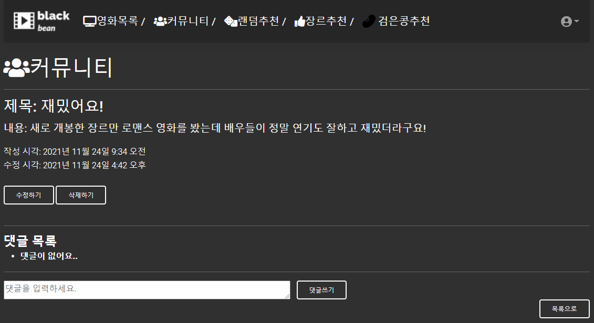

- 최대한 심플함을 유지하려고 했습니다.
- 기본적인 테이블 태그와, 페이지네이션을 사용해 페이지를 나누고
- 가볍게 부트스트랩으로 디자인만 했습니다.

---

### 4.랜덤추천

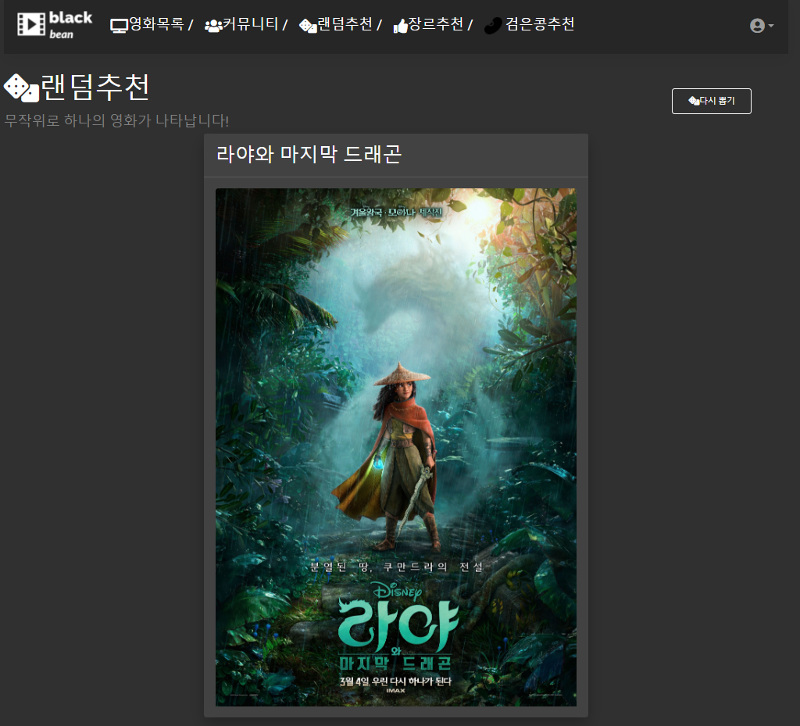

- 아까워서 넣은 보너스 기능 느낌입니다. 딱1개만 뜨게, 오직... 랜덤으로 나오게 구성했습니다.

  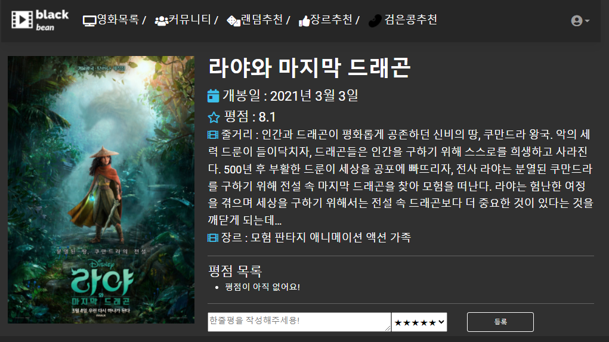

- 이 역시 영화 제목이나 포스터를 누르면 상세페이지로 이동할 수 있습니다.

---

### 5. 장르추천

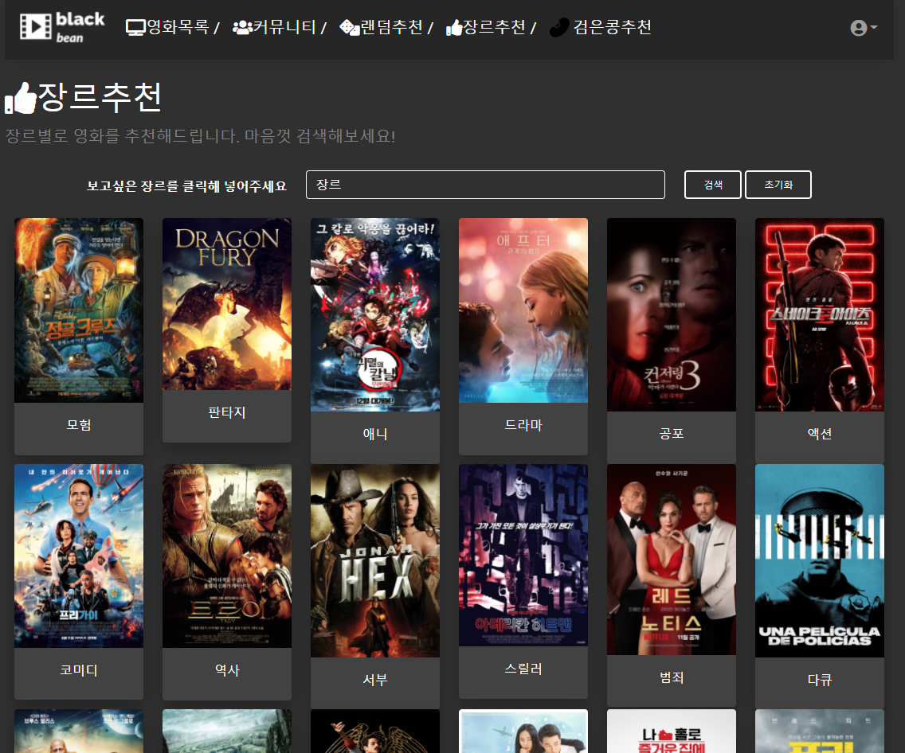

- 대망의 하이라이트 기능입니다. 포스터와 함께 장르가 나열 되어있습니다.

해당 포스터나 글자를 클릭하면 검색창으로 추가되고 가장 공통되는 장르가 겹치는 영화를 추천해줍니다.

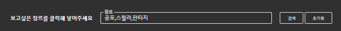

- 이렇게 말이죠

- 그리고 물론 중복되서 입력되지않게 함수도 추가로 만들어 줬습니다.

  ```python
  검색 인풋창을 쿼리셀렉터로 잡고
  클릭되면 안의 밸류를 채워주는 형식으로 구현했습니다.
  그리고 텍스트형테의 정보를 GET방식으로 넘겨줘
  해당장르 key값을 기반으로 검색을 한뒤
  다시 내부적으로 views.py에서 공통되는 장르 위주로 검색되게 설정 했습니다.
  
   genre = {
      '모험':'12',
      '판타지':'14',
      '애니':'16',
      '드라마':'18',
      '공포':'27',
      '액션':'28',
      '코미디':'35',
      '역사':'36',
      '서부':'37',
      '스릴러':'53',
      '범죄':'80',
      '다큐':'99',
      'SF':'878',
      '추리':'9648',
      '음악':'10402',
      '로맨스':'10749',
      '가족':'10751',
      '전쟁':'10752',
      'TV':'10770',
      }
  ```

  ---

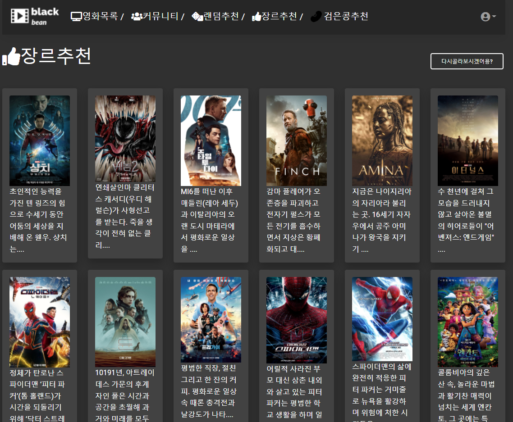

---

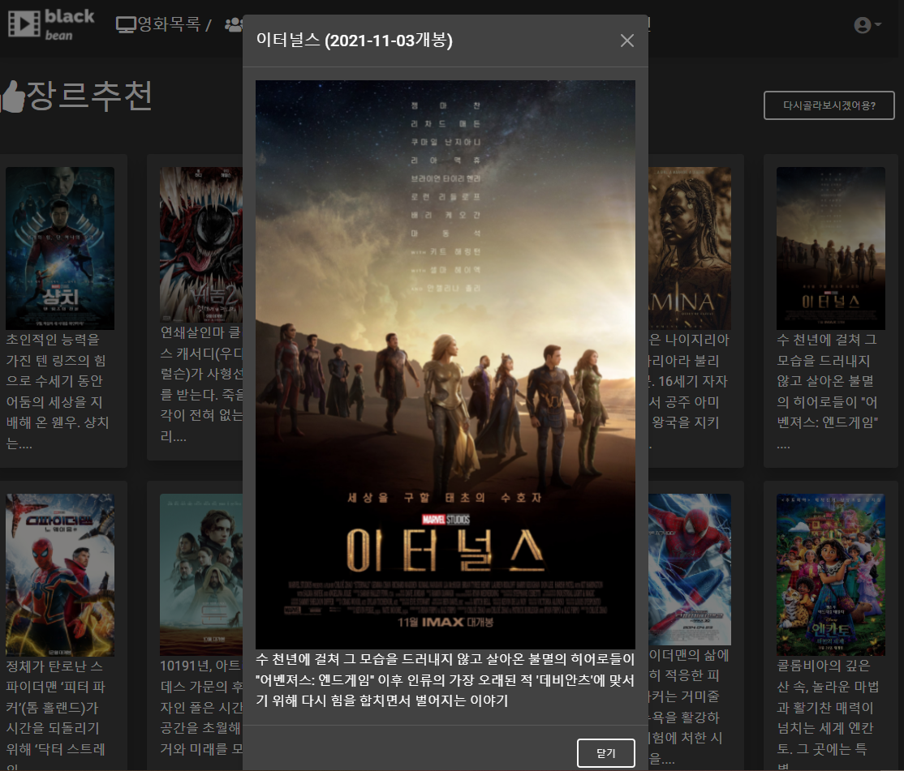

- 바로 이렇게 결과물이 나오게 됩니다. 해당 영화목록들은 이 사이트의 데이터 베이스의 등록된 자료들이 아니라 등록된 db를 바탕으로 tmdb에서 가져오는 추가 기능이기때문에 가벼운 모달로 정보만 뜨게 만들었습니다.

  

---

### 6.검은콩추천

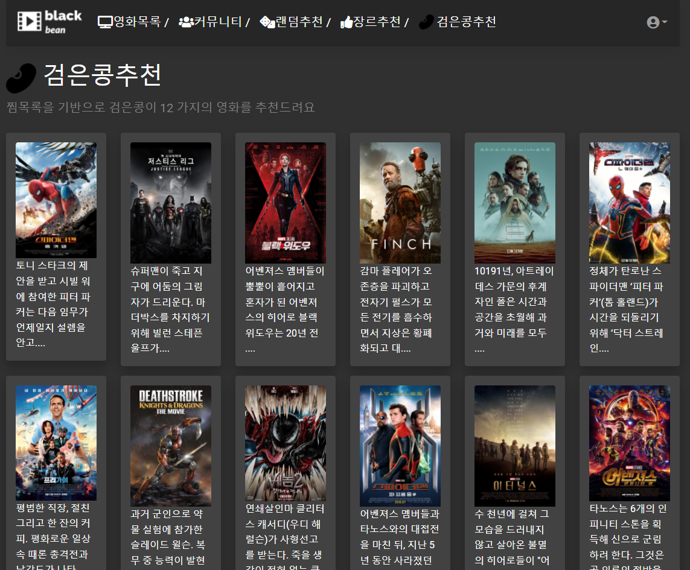


---

### 7. 프로필페이지

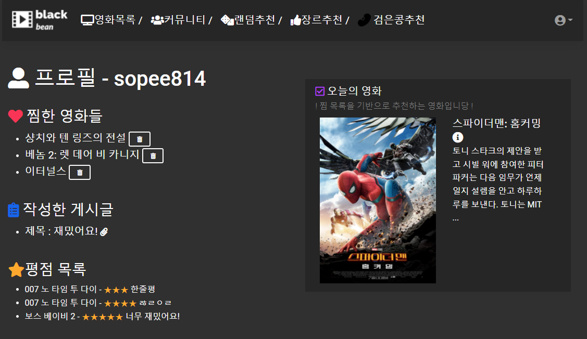

- 프로필페이지에서 가능한것
- 찜한영화들보기, 작성한게시글보기, 평점 목록보기 그리고...!
- 찜한 영화를 기반으로 영화를 추천해줍니다.
- 장르 추천과 비슷한 방식이기도 한대, 해당 사이트에서 찜한 영화목록들, 옆에 보이는 찜한 영화들을 기반으로
- 가장 유사한 영화를 추천해주게 만들었습니다.
- 추가적으로 상세페이지,찜한영화삭제,작성한 게시글,평점목록으로 바로가기를 모두 지원합니다.

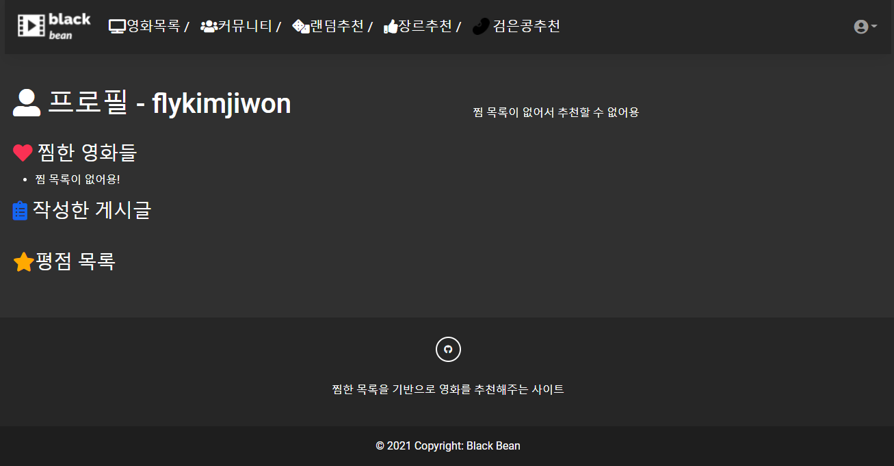

* 아무것도 찜하지 않은 사용자는 위와같이 뜹니다.

---

#### - 작은 디테일

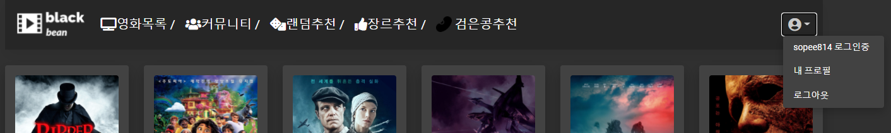

- 네브바를 이용해 구현했고, 폰트어썸을 이용해 아이콘을 넣었습니다. 또한 오른쪽 프로필 페이지도
- 마우스커서만 올리면 목록이 나오게 만들었습니다!

